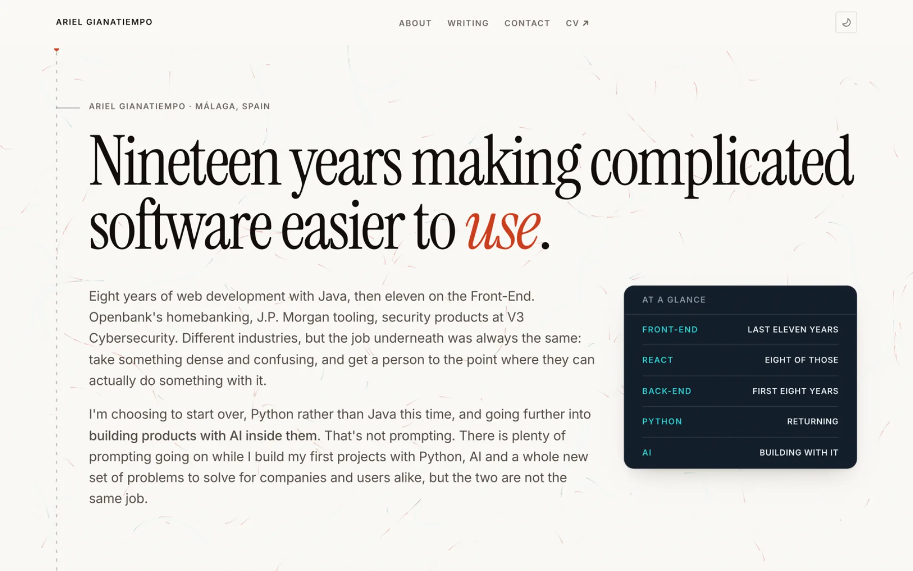
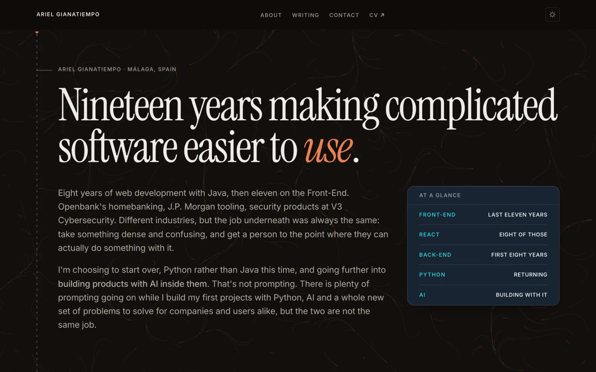

# Strata — a portfolio and writing template

An Astro + Tailwind site for a developer who writes. Built for someone with range — front-end work, server work, and whatever they are currently learning — who wants all of it to read as one publication with sections, the way a magazine does, rather than as a portfolio with a blog bolted on.

It takes a deliberate position on that: **the site never argues that the range belongs together.** Arguing it is what makes it sound doubtful. It states what it covers, files each piece under a beat, and lets the work carry it.

Live example: **[arielgianatiempo.com](https://arielgianatiempo.com)**

| Day                                                       | Night                                                   |
| --------------------------------------------------------- | ------------------------------------------------------- |
|  |  |

_The home page at 1440px. One palette per theme, both declared in `tokens.css`; the drifting field behind the type is the site's only canvas._

Almost no client JavaScript. One inline script sets the theme before first paint, a small bundle covers view transitions and the mobile menu, and one canvas draws the drifting field behind the page. Theming, motion, sidenotes, the reading-progress rail and the spine are pure CSS.

---

## Contents

1. [Quick start](#quick-start)
2. [Make it yours](#make-it-yours) — the checklist
3. [The design system](#the-design-system-strata)
4. [Pages and routes](#pages-and-routes)
5. [The home page, section by section](#the-home-page-section-by-section)
6. [Content: posts and projects](#content-posts-and-projects)
7. [Beats](#beats)
8. [Components you will reuse](#components-you-will-reuse)
9. [Link preview cards](#link-preview-cards)
10. [Motion and accessibility](#motion-and-accessibility)
11. [Deploying](#deploying)
12. [Gotchas](#gotchas)
13. [File map](#file-map)
14. [License](#license)

---

## Quick start

```sh
npm install
npm run dev        # http://localhost:4321
npm run build      # static output to ./dist
npm run preview    # serve the build
npx astro check    # typecheck .astro / .ts
npm run format     # prettier
```

Node 18+. The project uses Yarn in the lockfile but npm works fine; pick one and delete the other lockfile.

> **Run one `astro dev` at a time.** Two dev servers on this project share and clobber the `.astro/` content-collection cache, which shows up as `500 UnknownContentCollectionError` on post detail routes while every other route still returns 200. Astro dev also does not hot-reload `astro.config.mjs` — restart after changing it.

---

## Make it yours

Work through these in order. Everything listed here is copy or configuration; none of it requires touching a component.

### 1. Identity and URLs

| What                                                   | Where                                                  |
| ------------------------------------------------------ | ------------------------------------------------------ |
| Site URL (canonical tags, sitemap, RSS, OG image URLs) | `astro.config.mjs` → `site`                            |
| Title, description, email, posts-on-homepage count     | `src/lib/consts.ts` → `SITE`                           |
| Favicons                                               | `public/favicon-32.png`, `public/favicon-180.png`      |
| Browser chrome color                                   | `src/Layout.astro` → the two `theme-color` meta tags   |
| `robots.txt` (contains the sitemap URL)                | `public/robots.txt`                                    |
| CV / résumé PDF                                        | `public/` — then point the `CV` entry in `links` at it |

⚠️ The canonical URL comes from `site` in `astro.config.mjs` — that is the one to change. `SITE` in `consts.ts` holds the title, description, email and homepage post count.

### 2. Navigation

`src/lib/consts.ts` → `links`. Drives both the header and the footer. On-page anchors (`/#contact`) and routes (`/about`) can be mixed; keep anchors in the order the sections actually appear or you send people scrolling backwards. The footer splits the list into two columns automatically, so adding a seventh link doesn't break the grid.

External footer links (LinkedIn, GitHub, RSS) live in `src/AppFooter.astro` → `externalLinks`.

### 3. Your content data

All in `src/lib/consts.ts`:

| Export            | Feeds                                                     | Notes                                                              |
| ----------------- | --------------------------------------------------------- | ------------------------------------------------------------------ |
| `availability`    | Contact, and the card that closes every post              | Status, what you're open to, where. Once per page, at the close    |
| `identity`        | The "Who wrote this" card on every article                | Name, role, one plain-language paragraph                           |
| `beats`           | Entry taxonomy, `/beat/*` pages, the `/writing` masthead  | See [Beats](#beats)                                                |
| `forms`           | `post` / `project` labels on rows, in the rail and in RSS | See [Content](#content-posts-and-projects)                         |
| `practice`        | `/about` → Practice                                       | What you do. Only `label`, `status`, `plain` and `keywords` render |
| `timeline`        | `/about` → Milestones                                     | Career, newest first, with figures                                 |
| `testimonialData` | `/about`                                                  | Quotes from colleagues                                             |
| `facts`           | `/about` evidence panel                                   | Location, citizenship, languages                                   |
| `certifications`  | `/about`                                                  | Year / name / issuer                                               |

Prose that isn't in `consts.ts` is written directly in its component — the hero paragraphs in `src/components/Masthead.astro`, the biography in `src/pages/about.astro`. Both are marked with comments.

### 4. Color and type

`src/styles/tokens.css`. Two palettes and three fonts, all near the top of the file:

- `--ground-*` — the page. Declared twice: `:root` for day, `.dark` for night.
- `--ev-*` — the evidence plane. Declared once and used in both themes.
- `--font-display`, `--font-body`, `--font-mono` — plus the matching `@import` lines at the very top.

Swapping a font means changing the `@import` **and** the `--font-*` variable **and**, if you use link-preview cards, the font paths in `src/lib/og.ts` (see [Link preview cards](#link-preview-cards)).

### 5. The default social card

`public/og.png` is used by the home page and every standing page. Its source is `scripts/og-card.html` — open it at exactly 1200×630 and capture it:

```sh
npx playwright screenshot --viewport-size=1200,630 scripts/og-card.html public/og.png
```

Then update the fallback `ogImageAlt` string in `src/Layout.astro` to describe what the card now says. Posts and projects generate their own cards and don't use this file.

### 6. Housekeeping

- Delete `src/content/writing/*` and write your own.

---

## The design system: Strata

The whole system is one idea: **every piece of content exists at three depths, and the design makes the depths visible** so a reader can stop at any level with the point intact.

| Layer        | What it is                                                                   | How it looks                        | Class                      |
| ------------ | ---------------------------------------------------------------------------- | ----------------------------------- | -------------------------- |
| 1 · claim    | One plain sentence with no term a non-technical reader would have to look up | Serif, large, on the page           | `.claim`, `.claim-sm`      |
| 2 · account  | The prose, vocabulary intact                                                 | Body sans, at measure               | —                          |
| 3 · evidence | Numbers, code, tables, repos, dates                                          | Mono, dense, on a raised dark panel | `.evidence` / `<Evidence>` |

The important consequence: **dark ink means "here are the receipts", not "this section is about AI".** A number is legible to everyone regardless of vocabulary, which is why the evidence layer can be dense without excluding anybody.

Two rules worth keeping if you fork this:

1. **Evidence is a panel, never a full-bleed page band.** No exceptions. The moment a dark section runs edge to edge, the coldest, densest treatment starts winning on area and the page reads as "technical" rather than "readable with proof".
2. **Never let background lightness be the only signal.** Mono, rules and density carry the distinction too, which is why the system still works in dark mode where the two lightnesses converge.

### The token architecture

`.ink` re-points the live tokens (`--bg-canvas`, `--text-primary`, `--accent`, …) at the evidence palette. Because custom properties inherit, every Tailwind utility you've already written — `text-secondary`, `border-rule`, `text-accent` — keeps working inside it and resolves against the panel instead of the page. No `dark:` variants, no second stylesheet.

- `.ground` — the reverse: re-points back to the page palette. Needed when a page-colored element is nested inside an `.ink` subtree.
- `.evidence` — `.ink` plus the chrome (border, radius, lift, top sheen) and the mono voice.

### Type scale

Set as tokens, consumed through Tailwind (`text-display`, `text-h1`…`text-h3`, `text-row`, `text-figure`, `text-body-lg`, `text-body`, `text-meta`). All fluid via `clamp()` — there are no breakpoint-based font sizes.

Headings read `--display-weight` / `--display-scale` / `--display-track` rather than hard-coding them, so a panel that switches to the mono voice restyles its own headings with nothing respecified in the markup.

### Other useful classes

`.shell` (the 84rem page frame — its width is a site constant and never varies by route) · `.measure` / `.measure-wide` (reading widths) · `.rows` + `.row-link` (the hairline list every list on the site uses) · `.label` (small uppercase labels; `.time` for dates) · `.beat` (a dot + label marker) · `.figure` / `.figure-value` / `.figure-label` · `.section-head` / `.section-head--split` · `.spine` / `.tick` (the through-line and the marks that hang off it) · `.runaround` (prose flowing around a floated evidence panel).

---

## Pages and routes

| Route                       | File                                    | What it is                                           |
| --------------------------- | --------------------------------------- | ---------------------------------------------------- |
| `/`                         | `src/pages/index.astro`                 | Home. Composed from section components               |
| `/about`                    | `src/pages/about.astro`                 | Long-form biography, facts, certifications           |
| `/writing`                  | `src/pages/writing/index.astro`         | The archive, grouped by form, + the beats masthead   |
| `/writing/[slug]`           | `src/pages/writing/[...slug].astro`     | The long-form template, for posts and projects alike |
| `/beat/[beat]`              | `src/pages/beat/[beat].astro`           | One page per beat                                    |
| `/category/[c]`, `/tag/[t]` | `src/pages/category/`, `src/pages/tag/` | Generated from entry frontmatter                     |
| `/og/writing/[slug].png`    | `src/pages/og/[...slug].png.ts`         | Generated link-preview cards                         |
| `/rss.xml`                  | `src/pages/rss.xml.js`                  | Feed, carrying beat and form as categories           |
| `/404`                      | `src/pages/404.astro`                   |                                                      |

`/post`, `/post/[slug]`, `/project` and `/project/[slug]` are kept alive as redirects in `astro.config.mjs`. They were real routes before the two collections were merged, and a URL that has been shared once is a URL somebody else controls now — the slugs never changed, so every old link lands on the entry it always did.

`src/Layout.astro` wraps every page: `<head>`, metadata, the blocking theme script, header, footer, the spine and the signal field.

**Layout props:** `title`, `description`, `image`, `imageAlt`, `type`, `publishedDate`. If you pass `image`, pass `imageAlt` too.

---

## The home page, section by section

`src/pages/index.astro` is just an ordered list of components. Reorder, delete, or add freely — **the order is the argument**. The current order deliberately leads with the human material and puts the technical inventory after it.

| #   | Component           | Data source          | What it does                                                                                              |
| --- | ------------------- | -------------------- | --------------------------------------------------------------------------------------------------------- |
| 1   | `Masthead.astro`    | inline               | The claim, two paragraphs, an "At a glance" evidence panel run around by the prose                        |
| 2   | `WritingList.astro` | `writing` collection | Latest N entries (`SITE.NUM_ENTRIES_ON_HOMEPAGE`), newest first                                           |
| 3   | `Contact.astro`     | `availability`       | Props for `id`, `eyebrow`, `heading`, `body` so it can be reused with different copy (it is, on `/about`) |

Three blocks, deliberately. `Milestones`, `Practice` and `Testimonials` all used to sit here and now live on `/about`, which is where somebody goes once this page has already convinced them. The comment at the top of `index.astro` has the word counts that made the case.

### The spine

`src/components/Spine.astro` is the site's signature: one 2px hairline down the left gutter of every page, solid above where you are reading, a breathing marker at your position, and a dashed stroke below that crawls downward and never closes.

Nothing listens for scroll. A scroll-driven animation publishes the reading position into a registered `--progress` property and the gradient, the dashes and the marker all read it. Without a scroll timeline, or under `prefers-reduced-motion`, it renders as one unbroken hairline — which is the correct rest state, not a fallback.

It carries `transition:persist` so view transitions don't blink it out between pages, and it is positioned by nesting a real `.shell` inside an absolutely-positioned overlay, so it lands on the same x as the content at every width with nothing to keep in sync by hand. Put `.tick` on an element to draw a mark from it back to the line, and `.shell-river` on a section to hang its content off the spine.

### The signal field

`src/components/SignalField.astro` is the one piece of real JavaScript on the page: a few hundred points carried across a fixed canvas by a 2D simplex-noise flow field, each leaving a short fading trail. No dependency — the noise is ~40 lines, public domain, seeded per load. Particle count scales with viewport area and clamps between 140 and 420. Under `prefers-reduced-motion` it draws one still frame and stops.

To remove it, delete the `<SignalField />` line in `Layout.astro`. Nothing else references it.

---

## Content: posts and projects

**One collection, two forms.** Posts and projects are both `writing` entries with a `form` field, not two collections — a write-up about a build _is_ a piece of writing, and filing it elsewhere splits the one thing on a portfolio that is supposed to accumulate. Schema in `src/content/config.ts`. Markdown or MDX; a folder per entry with an `index.md` inside is the convention, but any `.md`/`.mdx` file works.

```
src/content/
└── writing/
    ├── 01_getting_started/index.md
    ├── 02_two_years_no_python/index.md
    └── portfolio/index.md
```

There is no `note` form and no `tldr` field. Both existed and both were removed on purpose; the reasoning is in the `FORMS` comment in `src/content/config.ts`.

Folder names are for ordering in your editor only — the URL comes from `slug` in frontmatter, or from the filename if you omit it.

### Posts

A post is a piece of writing. Create `src/content/writing/my-post/index.md`:

```yaml
---
title: 'Using AI is not a skill. Building with it is.'
slug: 'building-with-ai' # optional; the URL segment
description: 'Why I am going back to fullstack through Python.'
date: 2026-09-12T00:00:00Z
beat: 'trajectory' # frontend | backend | trajectory
form: 'post' # post | project
repoURL: 'https://github.com/you/thing' # optional, renders a repo panel
categories: ['career']
tags: ['python', 'ai']
draft: false
---
```

| Field                | Required | What it does                                                                                                                                                                   |
| -------------------- | -------- | ------------------------------------------------------------------------------------------------------------------------------------------------------------------------------ |
| `title`              | ✅       | `<h1>`, tab title, link-preview card                                                                                                                                           |
| `date`               | ✅       | Sorting, display, `article:published_time`                                                                                                                                     |
| `description`        | —        | **Layer one.** Rendered large in the serif under the title, and used for `<meta description>` and link previews. Write it as the plain-language answer to "what is this about" |
| `slug`               | —        | URL segment                                                                                                                                                                    |
| `beat`               | —        | Defaults to `trajectory`. See [Beats](#beats)                                                                                                                                  |
| `form`               | —        | Defaults to `post`. `project` adds a status and a stack to the rail                                                                                                            |
| `repoURL`            | —        | Renders a `RepoCard` below the article                                                                                                                                         |
| `categories`, `tags` | —        | Generate `/category/*` and `/tag/*` pages; also drive "Keep reading"                                                                                                           |
| `draft`              | —        | `true` excludes it from every list, route and feed                                                                                                                             |
| `author`             | —        | Defaults to the name in the schema                                                                                                                                             |

**In the body you get:** headings (`h2`s become the sticky table of contents), code blocks with theme-aware syntax highlighting, tables, blockquotes, `<details>` for optional detours, and **sidenotes** — write an ordinary GFM footnote (`text[^1]` … `[^1]: the note`) and `src/plugins/rehype-sidenotes.mjs` turns it into a numbered chip that expands in place. Pure CSS, no layout reserved for notes that don't exist.

### Projects

A project is a thing you built. Same collection, same folder, `form: 'project'`. Create `src/content/writing/my-thing/index.md`:

```yaml
---
title: 'This site'
description: 'An Astro portfolio built around three depths of explanation.'
date: 2026-09-17
beat: 'frontend'
form: 'project' # this is the only thing that makes it a project
status: 'In progress' # free text — "Shipping", "Archived", anything
stack: ['Astro', 'TypeScript', 'Tailwind']
repoURL: 'https://github.com/you/thing'
demoURL: 'https://example.com'
draft: false
---
```

Projects use the same long-form layout as posts. The rail carries beat, status, date, reading time and stack; `repoURL` renders a repo panel below the write-up; `demoURL` stays a plain link, because a running thing needs no explaining.

`status` is free text and deliberately honest — "In progress" is worth more than implying otherwise by omission.

---

## Beats

A beat is the subject facet that both posts and projects carry — the equivalent of a section in a magazine. **One collection with a `beat` field, not two collections**, because separate collections file subjects as if they were separate jobs.

Defined in two places that must agree:

1. `src/content/config.ts` → `BEATS` — the schema enum.
2. `src/lib/consts.ts` → `beats` — how each one is presented.

```ts
export const beats = {
	frontend: {
		label: 'Front-End',
		tone: 'warm', // warm | cool | ink
		plain: 'The part of the software people actually see and touch.',
		summary: "The user's side of the thing. React, UI, design…"
	}
	// …
}
```

- `plain` is layer one — the beat explained with no jargon.
- `summary` is layer two — the same thing with the vocabulary.
- `tone` maps to a color through `beatTone` in the same file: `warm` → `text-accent`, `cool` → `text-accent-alt`, `ink` → `text-primary`. Both accent tokens are already restated per background, so a beat marker stays legible on the page and on the evidence plane, in both themes.

**To rename or add a beat:** add the key to `BEATS`, add the matching entry to `beats`, and update the `beat:` field in any existing content. Everything else — `/beat/*` pages, the masthead, the archive markers, RSS categories, the link-preview cards — reads from those two places. The keys are URL segments (`/beat/frontend`), so they stay lowercase and unhyphenated even when the `label` isn't.

Beats render as a dot and a word, never as a page-scale treatment. That's the version that still works when the archive has forty entries in it.

---

## Components you will reuse

| Component            | Use it for                                                                                                                                                         |
| -------------------- | ------------------------------------------------------------------------------------------------------------------------------------------------------------------ |
| `Evidence.astro`     | Any raised dark panel. Optional `label` header, `bodyClass` to control padding. Forwards rest props, so `data-rise` and `style="--enter:n"` work on it             |
| `Figures.astro`      | A row of big numbers. Takes `items: { value, label }[]`. Source order is `dt`-then-`dd` and CSS flips them, so it announces correctly                              |
| `SectionHead.astro`  | Section lockup: `eyebrow` prop, heading in the default slot, standfirst in the `note` slot, `split` for the two-column variant                                     |
| `RepoCard.astro`     | Published code as evidence. `url`, optional `stack`                                                                                                                |
| `IdentityCard.astro` | The "Who wrote this" block. Reads `identity` from consts                                                                                                           |
| `Availability.astro` | The status line, and a link to the contact block. `href` defaults to `#contact`; pass `"/#contact"` from a page with no Contact section, or `false` for plain text |
| `MailLink.astro`     | An email link that never puts the address in the HTML — two base64 chunks assembled in the browser                                                                 |
| `WritingList.astro`  | The archive list. `list`, `feature` (enlarges the newest entry), `showForm` (off where a heading already names the form)                                           |
| `Spine.astro`        | The through-line. One per page, mounted by `Layout` — you should not need to place it yourself                                                                     |
| `SignalField.astro`  | The drifting canvas field. Mounted by `Layout`; delete that line to remove it                                                                                      |

### A worked example

```astro
---
import Evidence from '@components/Evidence.astro'
import Figures from '@components/Figures.astro'
---

<h3 class="text-h2">What the rewrite changed</h3>
<p class="claim claim-sm measure-wide mb-6">It got faster and it broke less often.</p>
<p class="measure-wide text-secondary">The MVP rewrite cut render time by 60% …</p>

<Evidence class="mt-9" label="Measured">
	<Figures
		items={[
			{ value: '60%', label: 'Faster' },
			{ value: '90%', label: 'Fewer bugs' }
		]}
	/>
</Evidence>
```

**One rule about figures:** every number should be quoted from the prose beside it. If a figure isn't already stated in the paragraph above it, it doesn't belong there. That check is what stops the shape becoming a template that has to be filled — in the example content, one timeline entry has no figures because its prose contains no number.

---

## Link preview cards

`src/pages/og/[...slug].png.ts` generates one 1200×630 PNG per entry at build time, using [satori](https://github.com/vercel/satori) + [resvg](https://github.com/yisibl/resvg-js). The card is Strata in one frame: the title as the claim in the serif on the cream ground, a raised ink strip underneath with the beat and the date, and the spine down the left gutter. `scripts/og-card.html` builds the default `public/og.png` to the same composition, so a link to the home page and a link to an entry read as two cards from one publication.

Routes mirror the pages — `/writing/x` → `/og/writing/x.png` — and the templates ask for their own URL by the same rule. `og:image:alt` is generated from the same inputs as the picture, so the two can't drift.

**To restyle:** `src/lib/og.ts`. The `COLOR` map mirrors `tokens.css` resolved to sRGB (satori has no `oklch()`) — if you change a palette token, change its twin here. `titleSize()` sets the three type steps.

⚠️ **Fonts.** Satori reads `.ttf`/`.otf`/`.woff` and **cannot read `.woff2`**, which is the only format Fontsource's _variable_ packages ship. That's why `@fontsource/jetbrains-mono` (the static build) is a devDependency alongside the variable one the site itself loads. If you swap fonts, make sure a `.woff` or `.ttf` exists and update the paths in `og.ts`.

---

## Motion and accessibility

Every scroll-linked and perpetual effect is native CSS — **no animation library, no smooth-scroll shim**. Scroll-linked effects use `animation-timeline: scroll()` / `view()` inside `@supports`, so browsers without scroll-driven animation get the static layout and no JavaScript fallback runs. The one exception is the signal field, which is a real per-frame canvas simulation; everything else on the page, the spine included, is a keyframe.

Attributes you can put on anything:

| Attribute      | Effect                                                                                |
| -------------- | ------------------------------------------------------------------------------------- |
| `data-rise`    | Fades and lifts as it scrolls into view                                               |
| `data-resolve` | The evidence entrance — a short focus-pull. Stagger with `style="--i:0"`, `1`, …      |
| `data-rule`    | Draws a horizontal rule from the left                                                 |
| `data-enter`   | On-load entrance for above-the-fold content. Stagger with `style="--enter:0"`, `1`, … |

The whole motion layer sits behind `prefers-reduced-motion: no-preference`, with a tiered `reduce` block that strips movement while keeping color and focus transitions. Content is visible by default — a failure mode can never hide it.

Perpetual effects read a single `--flow` clock through `sin()` at their own amplitude and phase, so everything moving is in step rather than drifting. With no clock running, `sin(0)` is 0 and each effect lands on the midpoint it oscillates around, which is the value it would have held anyway — so reduced motion, an unsupported browser and the first paint before the clock starts all render the same correct page.

Also in the box: text hierarchy tuned to clear WCAG AA at 13px (the comment in `tokens.css` explains why the grays are compressed), visible focus rings, `prefers-reduced-motion` honored, and semantic markup throughout.

**Theme:** a `.dark` class on `<html>`, set before first paint by a blocking inline script in `Layout.astro` and toggled by `src/components/base/ThemeIcon.astro`. Stored under the `theme` key in `localStorage`, defaulting to the OS preference.

---

## Deploying

Static output — `npm run build` writes `./dist`, which any static host will serve.

For Netlify or Vercel: build command `npm run build`, publish directory `dist`, no adapter needed. Set `site` in `astro.config.mjs` to your real domain **before** you build, or canonical tags, the sitemap, RSS links and the absolute OG image URLs will all point at the wrong place.

---

## Gotchas

**`tokens.css` loads after Tailwind.** A plain class rule in that file beats a Tailwind utility of the same specificity on source order. Anything in `tokens.css` that is a _default_ rather than a decision is therefore wrapped in `:where()` to drop it to zero specificity — see `.meta` and `.row-link`. If you add a rule there and a utility mysteriously stops working, this is why.

**One `astro dev` at a time.** See [Quick start](#quick-start).

**The sitemap has no filter, deliberately.** An earlier version excluded `/project` and kept every project out of search results long after the reason expired. If you add an exclusion, say which route and why.

**Fluid type has no breakpoints.** Don't add `md:text-xl` — change the `clamp()` in `tokens.css`.

**Dates are `en-US`.** Set in `src/components/blog/FormattedDate.astro` and mirrored in the `og:locale` meta tag in `Layout.astro`. Change both together.

---

## File map

```
public/              favicons, og.png, robots.txt, CV PDF
scripts/
└── og-card.html     source for the default public/og.png
src/
├── AppHeader.astro  fixed header, nav, theme toggle, mobile menu
├── AppFooter.astro  footer nav + external links
├── Layout.astro     <head>, metadata, theme script, page shell
├── components/
│   ├── Availability · Contact · Evidence · Figures · IdentityCard
│   ├── MailLink · Masthead · Milestones · RepoCard · SectionHead
│   ├── SignalField · Spine · Testimonials · WritingList
│   ├── base/        ThemeIcon
│   └── blog/        PostNavigation, FormattedDate, BackToPrevious
├── content/
│   ├── config.ts    collection schema + BEATS + FORMS
│   └── writing/     posts and projects, one collection
├── lib/
│   ├── consts.ts    site copy, nav, beats, all page data
│   ├── og.ts        link-preview card renderer
│   └── utils.ts     taxonomy, reading time, related items
├── pages/           routes (see the table above)
├── plugins/
│   └── rehype-sidenotes.mjs
└── styles/
    └── tokens.css   the design system
```

### Stack

Astro 4 · Tailwind CSS 3 · TypeScript · MDX · Shiki · `@astrojs/sitemap` · `@astrojs/rss` · `@tailwindcss/typography` · satori + resvg (build-time only).

---

## License

[MIT](LICENSE) — the code. Use it, fork it, ship your own version of it.

The content is not code: the posts in `src/content/writing/`, the biography and the quotes in `src/lib/consts.ts` and `src/pages/about.astro`, the CV in `public/`, and the brush calligraphy in `src/assets/` are mine and stay mine. Replacing them is step one of [Make it yours](#make-it-yours) anyway.

If you fork it or borrow an idea, a star is appreciated 😀

---

Built by **Ariel Gianatiempo** — [arielgianatiempo.com](https://arielgianatiempo.com) · [LinkedIn](https://www.linkedin.com/in/gianatiempo/) · [GitHub](https://github.com/gianatiempo)
